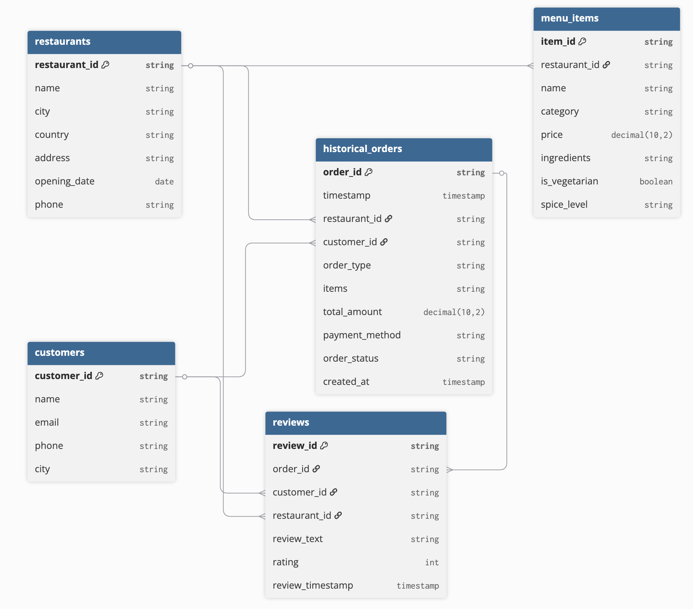
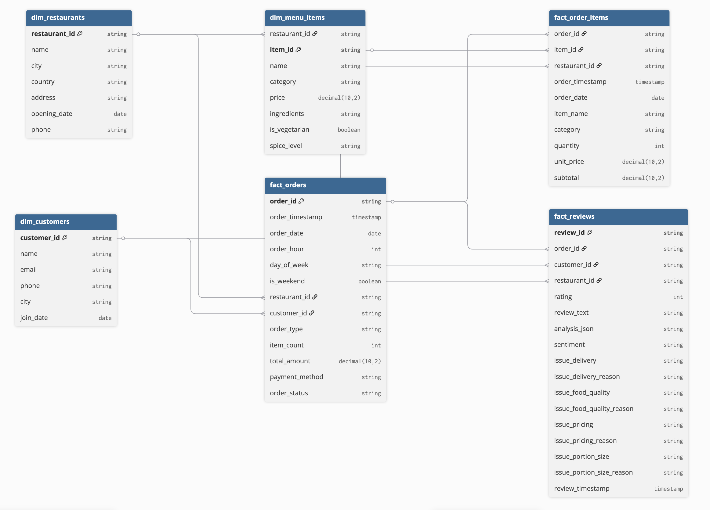

# Databricks End-To-End Project: Restaurant Analytics Platform

## 📖 Project Overview

This project is a comprehensive, hands-on implementation of a **Real-Time Restaurant Analytics Platform** built on Databricks. It follows the **Medallion Architecture** (Bronze, Silver, Gold) to ingest, process, and analyze streaming and batch data.

### Key Features

- ✅ **Streaming Ingestion** from Azure Event Hub
- ✅ **Batch Ingestion** from Azure SQL Database using Change Data Capture (CDC)
- ✅ **Data Transformation** using Spark Declarative Pipelines
- ✅ **Governance** with Unity Catalog
- ✅ **AI-Powered Analysis** (Sentiment Analysis on customer reviews)
- ✅ **Orchestration** with Databricks Workflows
- ✅ **Visualization** using Databricks AI/BI Dashboards

---

## 🏗️ Project Architecture

The architecture follows a clean, production-ready pattern:

### 1. Data Sources (Batch & Streaming)

| Source | Type | Description |
|--------|------|-------------|
| **Azure SQL Database** | Batch | Stores historical data for `customers`, `restaurants`, and `menu_items`. Change Data Capture (CDC) is enabled to track changes. |
| **Azure Event Hub** | Streaming | A Python script acts as a producer, simulating real-time `orders` and sending them as JSON events to an Event Hub. |

### 2. Ingestion Layer (Databricks LakeFlow Connect)

- **LakeFlow Connect** is used for both batch and streaming ingestion, providing a simple, declarative way to create reliable pipelines.
- **Bronze Tables:** Raw data from both sources lands in the `01_bronze` catalog/schema without any transformations.

### 3. Transformation Layer (Medallion Architecture)

| Layer | Catalog | Purpose |
|-------|---------|---------|
| **Silver** (`02_silver`) | Cleaned & Enriched | Raw data is cleaned, standardized, and enriched. |
| **Gold** (`03_gold`) | Aggregated | Business-level aggregates are created for dashboards and reporting. |

#### Silver Layer Details

| Table | Transformations |
|-------|----------------|
| `fact_orders` | Flattened JSON, added `order_date`, `order_hour`, `day_of_week`, `is_weekend` |
| `fact_reviews` | Sentiment analysis performed using Mosaic AI |
| `dim_customers` | Cleaned customer dimension |
| `dim_restaurants` | Cleaned restaurant dimension |
| `dim_menu_items` | Cleaned menu dimension |

`dim_customers` uses native Databricks Lakeflow AUTO CDC SCD Type 2 processing.
The business
key is `customer_id`; the CDC ingestion must provide `updated_at` as a monotonic
sequence and `cdc_operation` as `INSERT`, `UPDATE`, or `DELETE`. Name, email,
phone, and city changes create new history versions. Exact replays do not create
new versions. Records with the same customer and sequence value are considered
ambiguous and must be rejected by the upstream CDC ingestion because this
repository has no trustworthy tie-breaker. Deletes close the current version
while preserving historical versions. Lakeflow Connect setup is external to
this repository. The external ingestion configuration maps its connector/source
metadata into the canonical Bronze contract; the physical source metadata names
may differ by connector configuration. SQL Server Change Tracking alone is not
the SCD2 feed contract: the ingestion must provide an ordered CDC change stream
with inserts, updates, and deletes. The current customer-360 output reads the
current Silver SCD2 row (`__END_AT IS NULL`) and therefore does not join against
all historical versions; deleted customers have no current row.

#### Gold Layer Details

| Table | Purpose |
|-------|---------|
| `d_sales_summary` | Daily sales KPIs (revenue, orders, avg order value) |
| `d_customer_360` | Customer profile with loyalty tier and VIP flag |
| `d_restaurant_reviews` | Restaurant performance with rating distribution and sentiment counts |

### 4. Orchestration & Governance

| Component | Purpose |
|-----------|---------|
| **Databricks Workflows** | Orchestrates the entire pipeline (Ingestion → Silver → Gold) as a single, scheduled job |
| **Unity Catalog** | Provides centralized governance, fine-grained access control, and lineage tracking for all data assets |

### 5. Consumption Layer

- **AI/BI Dashboards:** Interactive dashboards visualizing key business metrics like sales trends, customer 360°, and restaurant review analysis with sentiment.

---

## 🛠️ Technology Stack

| Category | Technologies Used |
|:---------|:------------------|
| **Cloud Platform** | Microsoft Azure (Event Hub, SQL Database) |
| **Data Platform** | Databricks (Lakehouse, Workflows, Unity Catalog) |
| **Processing Engine** | Apache Spark (PySpark, Spark Structured Streaming, Spark Declarative Pipelines) |
| **AI & Analytics** | Mosaic AI (Sentiment Analysis), Databricks AI/BI Dashboards |
| **Languages** | Python, SQL, PySpark |
| **Other Tools** | Faker (Data Generation), dotenv, Azure Event Hubs SDK |

The implemented `d_customer_360` output uses an `is_vip` flag; churn-risk scoring is not part of this version.

---
