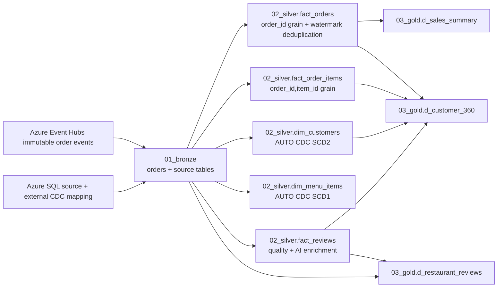

# Current implemented flow

This diagram shows the tables and flows defined in the repo. Azure resources,
Lakeflow Connect, and Databricks catalog/workflow setup are external.

```mermaid
flowchart LR
  SQL[Azure SQL source + external CDC mapping]
  EH[Azure Event Hubs immutable order events]
  B[01_bronze\norders + source tables]
  O[02_silver.fact_orders\norder_id grain + watermark deduplication]
  I[02_silver.fact_order_items\norder_id,item_id grain]
  C[02_silver.dim_customers\nAUTO CDC SCD2]
  M[02_silver.dim_menu_items\nAUTO CDC SCD1]
  R[02_silver.fact_reviews\nquality + AI enrichment]
  S[03_gold.d_sales_summary]
  CX[03_gold.d_customer_360]
  RR[03_gold.d_restaurant_reviews]

  EH --> B
  SQL --> B
  B --> O
  B --> I
  B --> C
  B --> M
  B --> R
  O --> S
  O --> CX
  I --> CX
  C --> CX
  R --> CX
  B --> RR
  R --> RR
```
